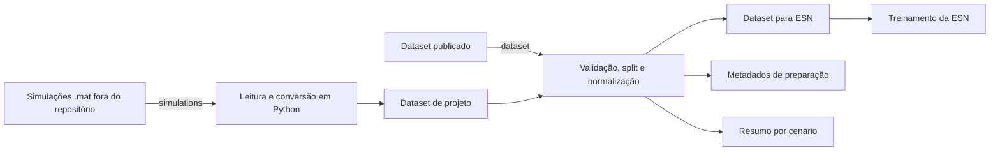

# Análise de cenários de execução de projetos de P&D

**SIOD · Projeto da disciplina · Rafael S. Valadão**

[Entrega da Aula 01 em PDF](docs/entrega-aula-01.pdf) · [Entrega da Atividade 02 em PDF](docs/entrega-atividade-02.pdf)

## Problema em cinco campos

**Contexto:** No planejamento de projetos de P&D, o cronograma e a capacidade prevista da equipe precisam ser avaliados diante de incertezas sobre retrabalho, trabalho não previsto e pressões de execução.

**Usuário:** Responsável pelo planejamento do projeto e pelas decisões sobre cronograma e capacidade da equipe.

**Dor:** Sem uma ferramenta que estime a evolução sob diferentes condições, o responsável decide com base no plano e na experiência, sem quantificar como as incertezas podem comprometer a conclusão. Isso dificulta avaliar a necessidade de revisar prazos ou capacidade antes da execução.

**Dados:** A planilha `EV_00000.xlsx` descreve um projeto de exemplo com sete atividades, equipe, esforço e predecessoras. O simulador do mestrado já produziu 10.000 cenários dessa estrutura, com 61 instantes (0 a 60 tu), em MAT/NPZ e metadados JSON. Este repositório disponibiliza a planilha, o recorte de 100 cenários em `data/simulacoes_100/`, as três saídas preparadas em `data/processed/` e um CSV temporal para consulta. As trajetórias são sintéticas; ainda não há histórico real de progresso confirmado para validação.

**Resultado esperado:** Apoiar a revisão de cronograma e capacidade, identificando condições em que o projeto não conclui no horizonte e comparando alternativas de planejamento. A escolha da intervenção permanece com o responsável pelo projeto.

## Hipótese aplicada

Se construirmos uma ferramenta de geração e análise de cenários usando o plano do projeto e um modelo dinâmico de execução, esperamos melhorar a identificação de condições que comprometem a conclusão para o responsável pelo planejamento, em comparação com decisões baseadas apenas no cronograma, na capacidade prevista e na experiência, sem acesso a cenários simulados.

**Avaliação proposta:** comparar a identificação de cenários críticos com e sem as informações da ferramenta, usando casos equivalentes e o mesmo horizonte. Medir acertos, omissões e falsos alertas. Inicialmente, a referência será o desfecho simulado; o benefício em projetos reais ainda precisa de validação.

## Arquitetura do pipeline inicial

O simulador representa a dinâmica de execução e gera a fonte da proposta. Como as simulações ocupam aproximadamente 1,53 GB, elas permanecem fora do repositório. Todo o código de leitura e preparação está em Python neste repositório. A pipeline pode começar nos arquivos `.mat` ou no NPZ já criado e prepara dados normalizados, metadados e um resumo por cenário para o treinamento e a análise.

## Maior risco e teste da semana

**Maior risco:** o modelo pode não representar adequadamente a execução real. **Teste da semana:** selecionar condições de referência, variar um parâmetro por vez no simulador e verificar a coerência das curvas e do indicador de conclusão. Esse teste avalia consistência interna; validação operacional dependerá de medições reais e calibração.

[Dados e limitações](docs/dados.md) · [Apresentação](docs/apresentacao.md) · [Execução](docs/execucao.md)

[Atividade 01 — Caracterização dos dados](docs/atividade-01-dados.md) · [Atividade 02 — Pipeline inicial](docs/atividade-02-pipeline.md) · [Notebook de exploração](notebooks/01_exploracao_dados.ipynb)
