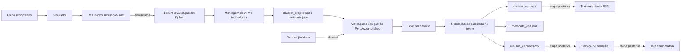

# Atividade 02 — Pipeline inicial de dados

**Projeto:** Análise de cenários de execução de projetos de P&D

**Responsável:** Rafael S. Valadão

## 1. Definição da entrada

A entrada primária é um diretório com arquivos `.mat` produzidos pelas simulações usando parâmetros gerados via LHS. Cada arquivo contém `P`, com a estrutura e os resultados temporais do projeto, e `parametros`, com uma linha para o cenário. São lidos cinco parâmetros: retrabalho esperado, trabalho não previsto esperado, pressão de cronograma, pressão gerencial e variação da capacidade. Em `P.Runtime`, `SimData` contém 61 instantes, de 0 a 60 tu, para o projeto agregado e para suas sete atividades. Entre as séries disponíveis estão `SimTime` e `PercAccomplished`.

O conjunto completo de simulações ocupa aproximadamente 1,53 GB e não faz parte do repositório. O repositório contém um ponto de entrada intermediário em `data/simulacoes_100/`: `dataset_projeto.npz` e `metadata.json`, derivados de 100 cenários sintéticos. O NPZ possui `X` com dimensão `(100, 61, 6)` e `Y` com dimensão `(100, 61, 19)`. O JSON registra os nomes e as dimensões necessários para interpretar esses tensores.

## 2. Definição da transformação

O fluxo completo executa estas etapas, na ordem:

1. localiza e ordena alfabeticamente os arquivos `.mat` do diretório informado;
2. lê `P` e `parametros` em Python;
3. valida a estrutura do projeto, as sete atividades, as tabelas `SimData`, a quantidade e a ordem das séries e a ausência de valores não finitos;
4. extrai os cinco parâmetros do cenário e as séries temporais do projeto agregado;
5. monta `X` repetindo os cinco parâmetros nos 61 instantes e acrescentando `SimTime`, e monta `Y` com as 19 séries de resultado na ordem documentada;
6. calcula os indicadores de conclusão e grava `dataset_projeto.npz` e `metadata.json` na mesma pasta;
7. valida o NPZ e o metadado, seleciona `PercAccomplished` como alvo e mantém os seis campos de `X` como entradas;
8. usa `simulation_id` quando ele existe no NPZ; quando não existe, atribui os IDs posicionais de 0 a `N-1`;
9. usa o split registrado no metadado ou cria um split determinístico por cenário, com 70% para treino, 15% para validação e o restante para teste;
10. calcula média e desvio somente com o treino e aplica a mesma normalização a treino, validação e teste;
11. grava o dataset normalizado, o metadado de preparação e o resumo por cenário.

A pipeline sempre segue esse fluxo. O modo escolhido apenas define o ponto de início: `simulations` começa na etapa 1, `generate-dataset` executa as etapas 1 a 6, e `dataset` começa na etapa 7 usando um NPZ já criado. A divisão aleatória usa internamente o valor fixo 42 para que o mesmo conjunto de cenários receba sempre o mesmo split.

## 3. Implementação

A implementação está em `scripts/pipeline.py` e `scripts/gerar_dataset.py`. Toda a conversão necessária está em Python e versionada neste repositório. O código do simulador e os arquivos de simulação não são necessários quando a execução começa no dataset publicado.

A chamada recebe o modo de execução e, quando necessário, um diretório:

- `dataset DIRETORIO`: começa em `dataset_projeto.npz`; sem diretório, usa `data/simulacoes_100/`;
- `simulations DIRETORIO`: executa o fluxo completo a partir dos `.mat`;
- `generate-dataset DIRETORIO`: gera somente `dataset_projeto.npz` e `metadata.json`.

`--output-dir` pode alterar o diretório de saída. `--max-simulations` limita a quantidade de `.mat` lidos nos dois modos de simulação e existe principalmente para validar a pipeline com um recorte pequeno. Os detalhes e exemplos completos estão em `docs/execucao.md`.

Os logs são emitidos no nível `INFO` durante toda a execução: modo e diretório selecionados, quantidade de arquivos, estrutura encontrada, progresso da leitura, split, validações, normalização e gravação.

## 4. Validações

| Grupo | Verificação | Resultado na execução publicada |
|---|---|---|
| Diretório | existência da pasta e quantidade mínima de sete simulações | aprovado |
| Simulação | presença de `P` e `parametros` em cada `.mat` | aprovado |
| Projeto | sete tarefas e oito registros em `Runtime` | aprovado |
| Tabelas | nomes, tipos numéricos, quantidade de linhas e ordem das séries | aprovado |
| Dataset | presença conjunta de `dataset_projeto.npz` e `metadata.json` na mesma pasta | aprovado |
| Estrutura | `X` e `Y` tridimensionais e compatíveis nos eixos cenário e tempo | aprovado |
| Identificadores | quantidade, tipo inteiro e ausência de IDs repetidos | aprovado |
| Valores | ausência de NaN e infinito nas entradas e no alvo | aprovado |
| Cenários | cinco parâmetros constantes nos 61 instantes | aprovado |
| Tempo | `SimTime` crescente, comum aos cenários e igual a 0–60 em 61 instantes | aprovado |
| Domínios | parâmetros nos intervalos do experimento e progresso entre 0 e 100, sem queda | aprovado |
| Split | cobertura completa dos cenários e ausência de sobreposição | aprovado |
| Normalização | parâmetros calculados somente no treino e resultado finito | aprovado |
| Saídas | reabertura dos três arquivos e conferência de dimensões e contagens | aprovado |

Uma falha interrompe a execução com uma mensagem `ERROR`. No modo completo, as saídas são:

- `data/processed/dataset_esn.npz`: `X` e `Y` normalizados, IDs e índices de treino, validação e teste;
- `data/processed/metadata_esn.json`: campos, dimensões, regra de split e parâmetros para normalizar e desnormalizar;
- `data/processed/resumo_cenarios.csv`: uma linha por cenário com parâmetros, conjunto, progresso final, conclusão, tempo de conclusão e déficit final.

## 5. Evidência de execução

A execução padrão recebeu 100 cenários com 61 instantes. A saída contém `X` com dimensão `(100, 61, 6)`, `Y` com dimensão `(100, 61, 1)` e 100 linhas no resumo. O split possui 70 cenários de treino, 15 de validação e 15 de teste. Foram observados 85 cenários concluídos e 15 não concluídos até 60 tu. Nenhum registro foi descartado, imputado ou corrigido.

As médias normalizadas do treino ficaram próximas de zero e os desvios próximos de um. Os três conjuntos não se sobrepõem e cobrem os 100 cenários. A desnormalização recuperou os valores originais dentro da precisão `float32`, e o resumo reproduziu os indicadores calculados diretamente de `PercAccomplished`.

O fluxo Python iniciado nas simulações também foi testado com dez arquivos `.mat`. A leitura encontrou sete tarefas, 61 instantes e 53 séries em cada simulação. O `X`, o `Y`, os três indicadores de conclusão e o split `7/1/2` ficaram exatamente iguais aos produzidos pelo fluxo anterior para os mesmos arquivos. O modo completo, começando nessas dez simulações, também produziu e validou as três saídas finais. Os arquivos temporários desse teste não fazem parte do repositório.

## 6. Atualização da arquitetura

A arquitetura macro da Aula 01 foi mantida: plano e hipóteses alimentam o simulador, os resultados passam por validação e preparação, e uma base local sustenta as etapas posteriores de análise, serviço de consulta e tela comparativa. A Atividade 02 detalha e implementa especificamente o trecho entre os resultados simulados e essa base local. Nesse trecho, passaram a ficar explícitos a leitura dos `.mat` em Python, o ponto alternativo de entrada pelo dataset já criado, o split por cenário, a normalização sem vazamento e as três saídas. A base local deixou de ser representada apenas como um CSV genérico e passou a distinguir o NPZ para treinamento, os metadados e o resumo legível. O treinamento de uma rede neural, o serviço e a interface continuam como etapas posteriores e não fazem parte da implementação desta atividade.

## 7. Registro de decisão

A implementação revelou que os arquivos `.mat` podem ser convertidos em Python, sem depender do código privado do simulador, e que o resultado reproduz exatamente o dataset anterior. Também mostrou que o NPZ existente já contém as sequências necessárias para o treinamento de uma rede neural, mas ainda exige split por cenário e normalização calculada somente com o treino. O volume de aproximadamente 1,53 GB das simulações tornou necessário manter um ponto de entrada intermediário pelo dataset publicado. Por fim, ficou clara a necessidade de separar a entrada técnica de treinamento, seus metadados e um resumo legível para conferência e análise dos cenários.
